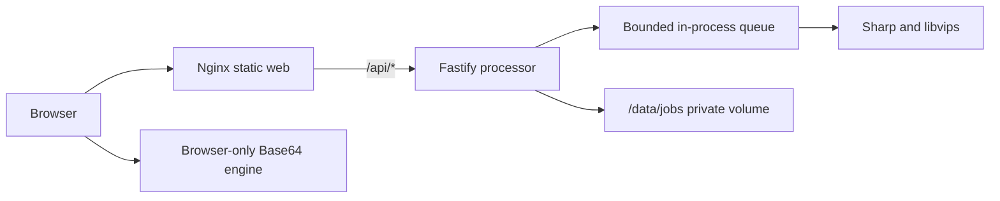

# Architecture

## Runtime

Astro prerenders public routes. Preact hydrates only the shared image workspace or the smaller Base64 workspace. Nginx serves fingerprinted assets, adds security headers, and proxies same-origin API requests. The processor is not published as a host port.

## Jobs and authorization

Every job receives a cryptographically random directory ID and an independent 256-bit capability token. Only a SHA-256 token hash is stored. Protected reads, previews, downloads, chaining, ZIP generation, and deletion require `Authorization: Bearer <token>`. IDs are never treated as authorization.

Each directory contains `job.json`, random-named source files, random-named outputs, and private previews. User filenames are sanitized metadata used only for downloads. Atomic metadata replacement prevents partially written job state.

## Upload and queue

Fastify multipart streams each file to disk. Request, file, batch, pixel, animation-frame, and free-disk limits are applied. File type comes from magic bytes plus Sharp metadata, never the extension or browser MIME alone. A two-slot FIFO queue is the default for the four-core target.

## Storage lifecycle

The processor creates `/data/jobs` with restrictive permissions, removes expired jobs at startup, repeats cleanup periodically, deletes failed uploads, and exposes Delete now. Local disk keeps the first deployment simple. A future object-store adapter can replace file persistence behind `JobStore` without changing operations or authorization.

## Image engine

Tool definitions map to a typed `Operation` union. User strings never select arbitrary libvips operations. Every output is decoded again to confirm format, dimensions, and byte size before the job reports success. Exact-size output also receives a final cap check.

## Chaining and batch

Batch sources share one job and operation. Results can be downloaded alone or streamed into a ZIP. A completed output can become the source of a new typed operation within the same job, so no re-upload is required.

## Deployment contract

The production Dockerfile builds a static `web` target and native `processor` target. Docker Compose defines the same network, health, environment, security, and volume contracts expected by Coolify. Only the reviewed locally validated contract may be deployed.
